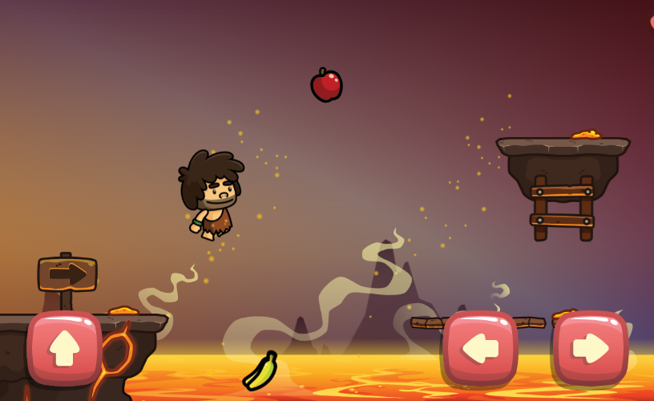

# Volcano game example

[](https://gitpod.io/#https://github.com/PhaserEditor2D/starter-template-basic-typescript)



This is a Phaser Editor 2D v3 game example.

## Configuration

* It includes the latest Phaser v3 runtime as a node package.
* It is coded in TypeScript. The `tsc` is included as a node package.
* It includes a VS Code project configuration (`jsconfig.json` file).

## Compiles the source code

This project is based on TypeScript so for getting the game running you need to compile the TypeScript files:

```bash
$ npm run build
```

It outputs the JavaScript code into the `game.js` file.

Often, you would like to run the TypeScript compiler in watch mode:

```bash
$ npm run watch
```

## Run the editor

* If you have NodeJS installed, you can run the editor using the `editor` NPM script, defined in the `package.json` file:

    ```bash
    $ npm install
    $ npm run editor
    ```

* If you are in a remote environment (like the Gitpod.io IDE), then run the editor like this:

    ```bash
    $ npm run editor-remote
    ```

* If you want to see all the editor options, run:

    ```bash
    $ npx phasereditor2d-launcher -help
    ```

* If Phaser Editor 2D Core is globally installed, you can run:

    ```bash
    $ PhaserEditor2D -project .
    ```